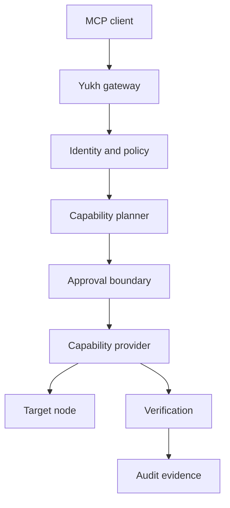

# Architecture

Yukh MCP separates reasoning, authorization, execution, and evidence.

## Boundaries

- The MCP client proposes intent; it is not an authorization authority.
- The gateway authenticates the caller and evaluates policy.
- Providers translate typed capabilities into target-specific operations.
- Credentials remain behind the execution boundary.
- Verification evaluates declared postconditions.
- Audit records are structured, redacted, and tamper-evident by design.

The architecture remains under public RFC review during foundation.

## Inert coordination consumer port

The MCP-owned coordination consumer contract is a provider-neutral application
port for the nonce-consumption and fenced-lease semantics required by the
accepted lifecycle RFCs. It validates closed, bounded requests and treats every
driver response as untrusted. Unknown versions or fields, binding substitution,
stale leases, timeout, and dependency failure stop progression without retry.

The port selects no protocol, endpoint, credential, deployment, or upstream
implementation. Its current driver is exercised only by network-free fakes and
is not wired into the gateway. Nonces and lease handles are sensitive runtime
material: they must never enter logs, audit evidence, errors, model context, or
durable repository context.

RFC-0005 now governs an MCP-native adapter implementation behind this port. The
adapter uses fixed Coordination primitives v1 routes, exact lifecycle-derived
digests, explicit authentication and an injected fetch-compatible transport.
It is merged and qualified over verified synthetic loopback TLS, and remains
disconnected from the gateway.

Issue #50 and accepted RFC-0006 govern the first disabled-by-default real
staging connection. It depends on accepted Coordination RFC-0022 under
`nomed/yukh-coordination#90`, uses explicit private trust and short-lived DPoP
material, and permits only a synthetic qualification runner. Until both RFCs
are separately implemented and hermetically qualified, no endpoint, credential,
real request, gateway wiring, provider execution, mutation or live apply is
authorized.
