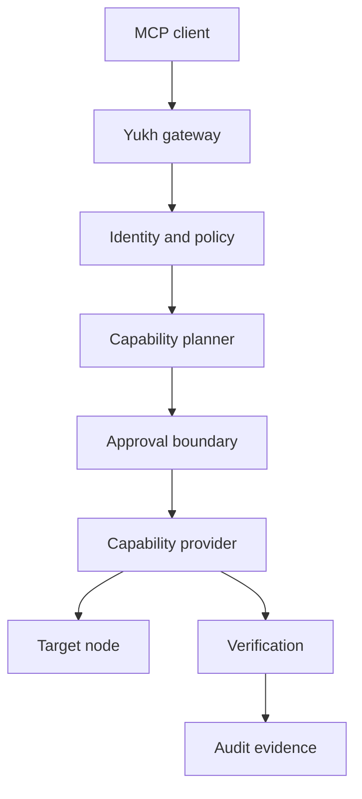

# Architecture

Yukh MCP separates reasoning, authorization, execution, and evidence.

## Boundaries

- The MCP client proposes intent; it is not an authorization authority.
- The gateway authenticates the caller and evaluates policy.
- Providers translate typed capabilities into target-specific operations.
- Credentials remain behind the execution boundary.
- Verification evaluates declared postconditions.
- Audit records are structured, redacted, and tamper-evident by design.

The architecture remains under public RFC review during foundation.

## Inert coordination consumer port

The MCP-owned coordination consumer contract is a provider-neutral application
port for the nonce-consumption and fenced-lease semantics required by the
accepted lifecycle RFCs. It validates closed, bounded requests and treats every
driver response as untrusted. Unknown versions or fields, binding substitution,
stale leases, timeout, and dependency failure stop progression without retry.

The port selects no protocol, endpoint, credential, deployment, or upstream
implementation. Its current driver is exercised only by network-free fakes and
is not wired into the gateway. Nonces and lease handles are sensitive runtime
material: they must never enter logs, audit evidence, errors, model context, or
durable repository context.

Real integration remains blocked until `nomed/yukh-coordination#71` is merged
and its stable consumer contract is reviewed. That future increment must adapt
the stable contract at this port; it must not copy Coordination components into
Yukh MCP.
