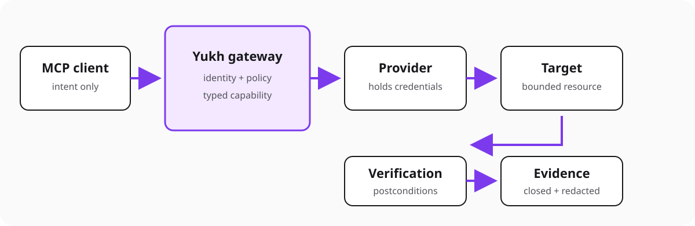

# Architecture

Yukh MCP keeps client intent, policy, provider authority, and evidence in
separate boundaries.

## Boundaries

- **Client:** proposes intent; never supplies execution authority.
- **Gateway:** validates the capability and enforces identity and policy.
- **Provider:** holds bounded target authority; credentials stay here.
- **Verifier:** evaluates declared postconditions independently from execution.
- **Evidence:** records decisions and outcomes in closed, redacted structures.

Mutations add a bound plan and approval between policy and provider invocation.
The current public demo is read-only.

## Inert coordination consumer port

The Coordination consumer port supports nonce consumption and fenced leases
required by accepted mutation lifecycle contracts. It treats every response as
untrusted and stops on invalid data, stale state, timeout, or dependency failure.

The reviewed HTTPS adapter is qualified only against synthetic loopback TLS. It
is not wired into the gateway and has no real endpoint or credential. Nonces
and lease handles never enter logs, evidence, errors, model context, or the
repository.

RFC-0005 governs the adapter. RFC-0006 and issue #50 govern the first
disabled-by-default staging qualification. They authorize no production
endpoint, gateway wiring, provider execution, mutation, or live apply.

## Audit evidence foundation

The RFC-0004 audit package validates closed typed candidates, checks direct
causation, assigns per-stream order and hash links, and verifies retained event
ranges. The included in-memory store is conformance-only and is rejected by the
pre-effect lifecycle guard because it cannot provide a durable receipt.

Post-start writer failure crosses only a bounded recovery-fact interface,
withholds success, and does not retry provider work. No audit package is wired
into the gateway, and no durable store, checkpoint authority, recovery profile,
provider, credential, or mutation is selected.

## Event and subject policy

Distributed runtime state must not depend on node-local log files. Yukh uses
bounded event streams, CloudEvents-like envelopes and NATS subjects as routing
keys. The [event and subject policy](event-subject-policy.md) defines the
Projects, Orchestration, Coordination and Runtime streams, including the
`worker.activity.v1` runtime event contract.
