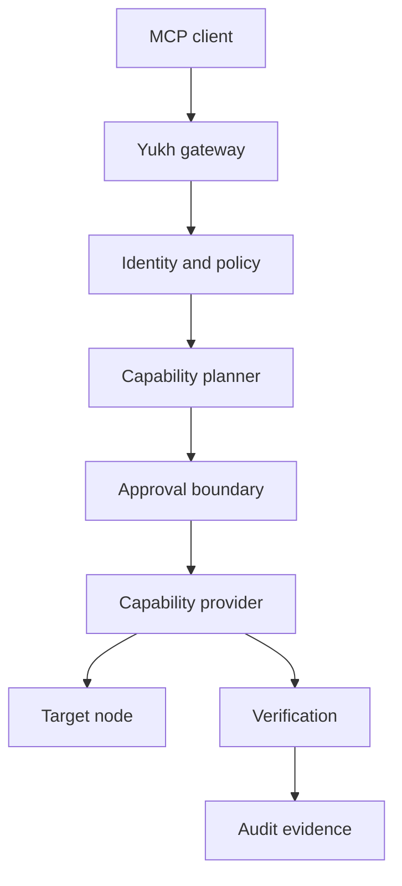

# Architecture

Yukh MCP separates reasoning, authorization, execution, and evidence.

## Boundaries

- The MCP client proposes intent; it is not an authorization authority.
- The gateway authenticates the caller and evaluates policy.
- Providers translate typed capabilities into target-specific operations.
- Credentials remain behind the execution boundary.
- Verification evaluates declared postconditions.
- Audit records are structured, redacted, and tamper-evident by design.

The architecture remains under public RFC review during foundation.
